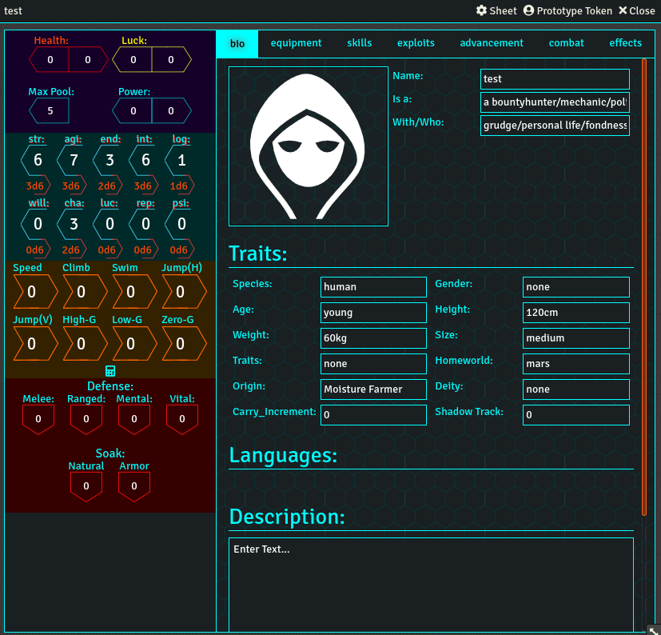
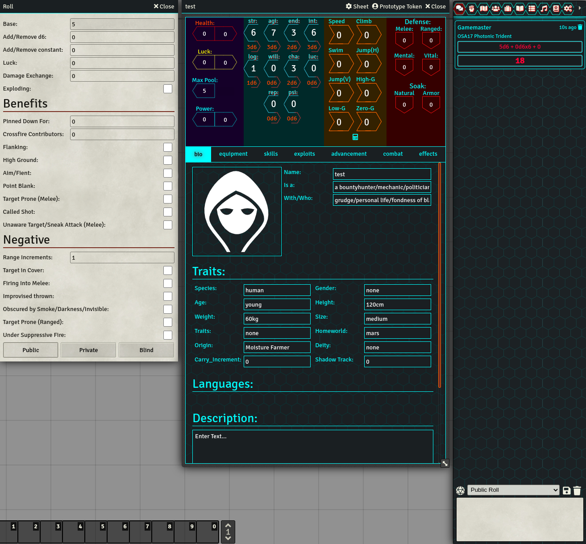

# Maintenance Note
Due to work and no longer having a group to run WOIN with development has paused (possibly forever). If there is enough demand I may put in the work to get the system up to date with the latest foundry version, but don't expect new features. WOINFoundry still runs great on foundry V9 in case you need a way to play WOIN in a VTT, however does not support foundry V10 or newer.

# WOINFoundry
WOINFoundry adds support for WOIN to Foundry. I made this system for my groups NEW game (so the theming and compendiums support NEW), but this should be able to support OLD, NOW, etc just without compendiums.

Contributions for other compendiums would be appreciated.

Currently the system runs stable on foundry v9, though given the upgrade was recent there may be some bugs (please report them if you run into any).

# Images

# Old Repo:
WOINFoundry used to be found at https://gitlab.com/mcarthur.alford/woinfoundry prior to migrating to github. Older versions can be found there.

# What is WOIN?
The WOIN rules and information can be found at http://www.woinrpg.com/.
All content used in the system is under the open games license version 1.0a, found at http://www.woinrpg.com/open-gaming-license.
