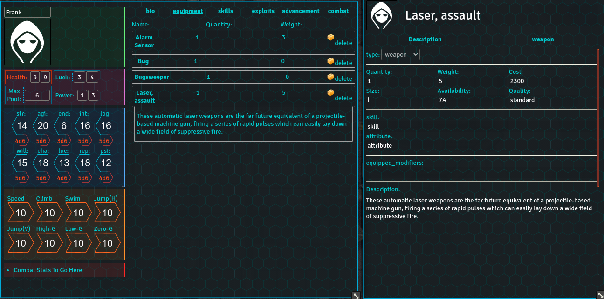

# WOINFoundry
WOINFoundry brings the functionality of the WOIN role-playing system to foundryvtt. 

# Level of Support:
WOIN is a flexible system with many rulesets and supplementary books. The WOINFoundry system currently is limited to NEW rules, though should be usable for other rulesets.

The system itself is still in development, with sheets now functional for data entry, and plans to implement calculations and automation very soon.

# Pictures!

# What is WOIN?
The WOIN rules and information can be found at http://www.woinrpg.com/.
All content used in the system is under the open games license version 1.0a, found at http://www.woinrpg.com/open-gaming-license.